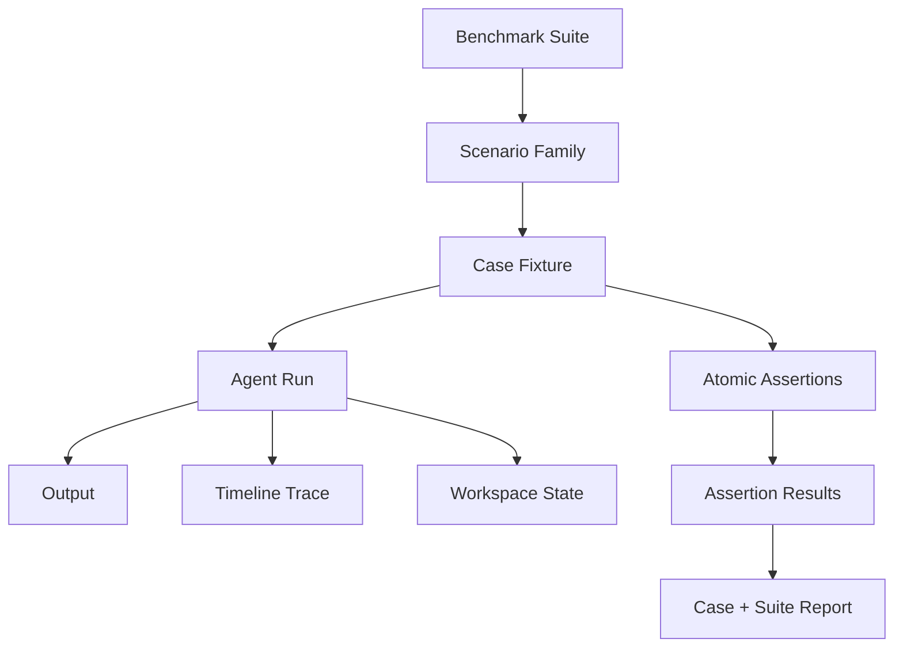
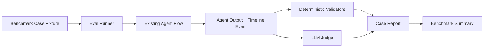

# ProjectFlow AgentEval v2 Professional Benchmark Specification

**Document status:** Draft, research-backed redesign  
**Snapshot date:** 2026-06-05  
**Scope:** ProjectFlow MVP Agent output quality, reliability, and function-fit evaluation  
**Supersedes:** v1 broad-rubric benchmark in Appendix A

**Current implementation status (2026-06-08):** 49 cases across 10 modules. Mock mode: 49/49. Real mode: 46/49 (up from 18/49). Fixture schema updated to current `WorkspaceStateResponse` (owner_user_id, can_cut, stage_id, etc.). 27 fixtures migrated. Assertion/validator fixes applied for dependency_ids_exist, fabricated_workspace_entity, and negation markers. See `output/agent-eval/HISTORY.md` for run history.  

---

## 1. Executive Decision

ProjectFlow 的 Agent benchmark 不应继续停留在“12 个宽泛维度 + LLM Judge 主观打分”。这类评分能快速发现明显问题，但无法稳定指导修复，也难以证明一次 prompt 或代码改动真的提升了质量。

v2 采用专业 Agent benchmark 的共同结构：

```text
realistic scenario -> controlled workspace state -> agent run
-> final output + timeline trace + optional persisted proposal
-> atomic assertions -> evidence-backed report -> regression comparison
```

核心变化：

1. 从“维度打分”转为“原子断言”。每个 case 由 20-40 条可验证 assertion 组成。
2. 从“只看最终文本”扩展为“最终输出 + 中间轨迹 + 状态引用 + 持久化结果”。
3. 从“LLM Judge 决定成败”改为“确定性规则优先，LLM Judge 只处理语义质量”。
4. 从“一次运行分数”扩展为“多次运行稳定性、失败类型分布、回归对比”。
5. 从“泛 Agent 能力”收敛到 ProjectFlow MVP 场景：大学生项目小队、单 workspace、人工确认、无外部集成、主动推进闭环。

v2 benchmark 的目标不是评估模型“聪不聪明”，而是评估 ProjectFlow Agent 在产品边界内是否可靠、可用、可迭代。

---

## 2. External Benchmark Research Synthesis

本设计参考的外部 benchmark 不直接照搬任务类型，只迁移评测方法。ProjectFlow 不是通用网页 Agent、桌面 Agent 或代码修复 Agent，因此 benchmark 必须贴合产品场景。

| Benchmark | What it evaluates | Transferable idea for ProjectFlow | What not to copy |
|---|---|---|---|
| [AgentBench](https://arxiv.org/abs/2308.03688), [repo](https://github.com/THUDM/AgentBench) | LLM-as-agent 在多环境、多轮任务中的表现 | 多任务族、多轮交互、统一 harness | 不做通用 Agent 排行榜 |
| [AgentBoard](https://hkust-nlp.github.io/agentboard/), [repo](https://github.com/hkust-nlp/AgentBoard) | 多轮 Agent 的 progress rate、grounding、trajectory 质量 | 不只看 final answer, 也看过程是否有效推进 | 不引入复杂多环境 runtime |
| [WebArena](https://arxiv.org/abs/2307.13854), [repo](https://github.com/web-arena-x/webarena) | 真实网站环境中的自主网页任务 | 用 realistic end-state 判断任务完成，而非静态问答 | ProjectFlow MVP 不做浏览器操作 benchmark |
| [WorkArena](https://www.servicenow.com/research/publication/alexandre-drouin-work-icml2024.html), [repo](https://github.com/ServiceNow/BrowserGym/tree/main/browsergym/workarena) | 企业软件工作流中的 Agent 任务 | 业务状态、角色约束、最终状态正确性 | 不复制 ServiceNow 域模型 |
| [TheAgentCompany](https://arxiv.org/abs/2412.14161), [repo](https://github.com/TheAgentCompany/TheAgentCompany) | 模拟公司环境中的长期工作任务 | 工作流任务需要跨步骤、跨角色、一致性验证 | ProjectFlow 不需要长时自治公司模拟 |
| [tau-bench](https://arxiv.org/abs/2406.12045), [repo](https://github.com/sierra-research/tau2-bench) | 动态对话、工具调用、策略遵循 | 用 policy constraints 和 hidden user goals 测真实可靠性 | 当前 Agent 没有复杂客服工具链 |
| [SWE-bench Verified](https://openai.com/index/introducing-swe-bench-verified/), [leaderboard](https://www.swebench.com/) | 真实 GitHub issue 修复的可执行正确性 | 人工筛选高质量 case, 以可执行验证减少主观性 | 不把 ProjectFlow 评测变成代码修复评测 |
| [GAIA](https://arxiv.org/abs/2311.12983) | 通用助理在真实问题上的推理、工具、信息检索能力 | 任务必须非琐碎，且答案需要可核查证据 | ProjectFlow MVP 不评估开放域搜索 |
| [OSWorld](https://os-world.github.io/), [paper](https://arxiv.org/abs/2404.07972) | 桌面环境中的多步操作 Agent | 初始状态隔离、环境可复现、轨迹评估 | 不引入桌面操作环境 |
| [Mind2Web](https://arxiv.org/abs/2306.06070), [repo](https://github.com/OSU-NLP-Group/Mind2Web) | 网页任务的 action prediction 与泛化 | 从自然语言目标映射到结构化步骤 | 不评估 DOM action 选择 |
| [VisualWebArena](https://arxiv.org/abs/2401.13649), [repo](https://github.com/web-arena-x/visualwebarena) | 视觉网页任务 | 多模态 evidence 的思想可借鉴 | MVP Agent 当前没有视觉输入 |
| [BrowserGym](https://github.com/ServiceNow/BrowserGym) | 浏览器 Agent 的统一环境接口 | benchmark harness 应该独立于具体模型和运行模式 | 不引入 browser runtime |
| [BrowseComp](https://openai.com/index/browsecomp/), [paper](https://arxiv.org/abs/2504.12516) | 难检索问题的浏览能力 | 评测任务要避免浅层 keyword shortcut | ProjectFlow MVP 不需要联网研究能力 |
| [Deep Research Bench](https://arxiv.org/abs/2506.06287) and [LiveResearchBench](https://livedeepresearch.github.io/) | 深度研究报告质量 | 对“方向澄清”可借鉴 source grounding、coverage、synthesis rubric | 当前产品不应直接承诺自动 deep research |
| [Berkeley Function Calling Leaderboard](https://gorilla.cs.berkeley.edu/leaderboard) | 函数调用、工具使用、参数可靠性 | 工具输出结构和参数正确性应可确定性验证 | 当前 Agent 工具面较窄，不做通用 tool calling 评测 |
| [ToolBench](https://arxiv.org/abs/2307.16789), [repo](https://github.com/OpenBMB/ToolBench) | 工具学习和多工具调用 | 工具失败、错误恢复、调用路径可以单独评分 | 不引入外部 API marketplace |
| [API-Bank](https://arxiv.org/abs/2304.08244), [repo](https://github.com/AlibabaResearch/DAMO-ConvAI/tree/main/api-bank) | 工具增强对话 Agent 的 planning 与 API 调用 | 对话状态、API 状态、结果一致性三者要一起检查 | 不复制银行类任务 |

结论：权威 Agent benchmark 的共同点不是“评分维度更多”，而是“任务状态真实、验证可执行、失败可归因、结果可复现”。

---

## 3. ProjectFlow-Specific Evaluation Principles

### 3.1 Product-grounded realism

每个 case 必须来自 ProjectFlow MVP 的真实用户路径：

- 项目方向澄清
- 阶段计划生成
- 任务拆解
- 分工推荐
- 分工协调确认
- 主动推进
- check-in 和状态更新
- 风险识别
- 动态重排
- 下一步行动卡

benchmark 不评估 MVP 外的能力，例如外部日历、飞书、GitHub、教务系统、桌面端、移动端、复杂多 workspace。

### 3.2 Assertion-first, rubric-second

宽泛评分只能回答“好不好”，不能回答“哪里坏”。v2 中每个 case 都必须拆成原子断言：

```text
case score = deterministic hard gates + weighted assertion score + limited LLM semantic judgement
```

示例：

| Bad broad metric | Better atomic assertion |
|---|---|
| MVP 边界控制 | 输出不得建议 desktop app、mobile app、calendar integration、GitHub integration |
| 当前时间正确 | 若 current_time 为 2026-06-05, 本周应覆盖 2026-06-01 到 2026-06-07 |
| 任务拆解质量 | 若输出中描述 backend before frontend, dependency_ids 不得全部为空 |
| 重排有效性 | 高风险延期 case 中 new_plan 不得与 old_plan 完全等价 |

### 3.3 Deterministic gates before LLM Judge

LLM Judge 只能处理语义性判断，例如“澄清问题是否覆盖关键未知”。以下必须由确定性或半确定性规则检查：

- JSON schema 合法性
- required field 是否存在
- forbidden terms 是否出现
- 日期计算是否正确
- task dependency ids 是否引用存在任务
- proposal 是否需要用户确认
- 是否越过 MVP non-goals
- 是否包含空洞 fallback

### 3.4 Trace and state evidence

每条重要判断都要能落到 evidence：

- workspace_state path, such as `project.name` or `members[].availability`
- agent output path, such as `stages[0].deadline`
- timeline event path, such as `timeline[2].module`
- persisted proposal path, if the route persists a proposal
- raw text span, only when structured path unavailable

没有 evidence 的 LLM 评价不得作为 hard fail 的唯一依据。

### 3.5 Stability is a first-class metric

真实 LLM 输出有随机性，单次运行不代表可靠性。v2 必须支持：

- `pass@1`: 单次通过率
- `pass^k`: 连续 k 次全部通过的概率近似
- `variance`: 同一 case 多次分数方差
- `failure_consistency`: 同一 case 是否反复触发同类失败
- `flaky_assertions`: 偶发失败的 assertion 列表

ProjectFlow 的可用性更接近 `pass^3` 或 `pass^5`，不是单次平均分。

### 3.6 Safety and permission boundaries

ProjectFlow Agent 不能绕过人工确认机制。任何建议写入项目状态、修改计划、改分工、重排任务的行为都必须符合：

- 输出 proposal, not direct mutation
- 明确需要用户确认
- proposal 内容可解释、可回滚
- 不隐式代表用户同意

---

## 4. Evaluation Object Model



### 4.1 Suite

Suite 是一次 benchmark 的集合，固定版本号和运行配置。

Required fields:

```json
{
  "suite_id": "projectflow-agent-v2",
  "version": "2.0.0",
  "snapshot_date": "2026-06-05",
  "model": "glm-5.1",
  "mode": "mock|real",
  "run_count_per_case": 1
}
```

### 4.2 Scenario family

Scenario family 表示业务任务族：

| Family | Purpose |
|---|---|
| `clarification` | 方向澄清是否深入、聚焦、符合 MVP |
| `planning` | 阶段计划是否可执行、边界受控 |
| `breakdown` | 任务拆解是否有依赖、粒度、验收标准 |
| `assignment` | 分工推荐是否考虑能力、时间、负载 |
| `negotiation` | 分工协调是否尊重异议并形成确认 proposal |
| `active_push` | 主动推进是否能发现停滞并给出下一步 |
| `risk` | 风险识别是否准确、可行动 |
| `replanning` | 动态重排是否真的改变计划并解释代价 |
| `reliability` | JSON 修复、fallback、超时、provider error 是否可控 |

### 4.3 Case fixture

Case 是最小可运行任务，应包含完整 workspace 状态、入口模块、用户输入、期望断言和禁止行为。

Recommended schema:

```json
{
  "id": "plan_scope_control_v2",
  "family": "planning",
  "entrypoint": "planning",
  "difficulty": "hard",
  "workspace_state": {
    "project": {},
    "members": [],
    "tasks": [],
    "timeline": [],
    "current_time": "2026-06-05T10:00:00+08:00"
  },
  "user_message": "我们 3 周内要做一个课程项目 MVP。",
  "assertions": [],
  "metadata": {
    "mvp_boundary_focus": true,
    "requires_current_time": true
  }
}
```

### 4.4 Assertion

Assertion 是 v2 的核心。

Recommended schema:

```json
{
  "id": "planning_no_external_integrations",
  "group": "mvp_boundary",
  "severity": "hard",
  "evaluator": "deterministic_text",
  "target": "agent_output",
  "rule": "forbidden_terms_absent",
  "forbidden": ["GitHub", "calendar integration", "教务系统", "飞书", "桌面端", "移动端"],
  "evidence_paths": ["agent_output.raw_text"],
  "failure_category": "scope_creep",
  "remediation_hint": "Tighten MVP boundary prompt and add deterministic post-check."
}
```

Severity:

| Severity | Meaning | Case impact |
|---|---|---|
| `hard` | Product boundary, safety, schema, persistence, or time correctness violation | Case fails regardless of weighted score |
| `major` | Core usefulness failure | Large score penalty |
| `minor` | Polish, wording, completeness issue | Small score penalty |
| `info` | Diagnostic only | No direct penalty |

Evaluator:

| Evaluator | Use case |
|---|---|
| `schema` | Pydantic / JSON contract validation |
| `deterministic_text` | forbidden / required phrases, regex, length bounds |
| `deterministic_date` | current time, week/month/relative date logic |
| `state_path` | output references fields that exist in workspace state |
| `graph` | dependency ids, task ordering, cycle detection |
| `diff` | before/after replan actually changed |
| `trace` | correct module chosen, fallback path visible |
| `llm_semantic` | quality, synthesis, ambiguity handling |
| `stability` | pass^k, variance, repeated failure type |

---

## 5. Scoring Model

### 5.1 Case pass/fail

A case passes only if:

1. No `hard` assertion fails.
2. Weighted score is at least the configured threshold.
3. Required artifacts are present.
4. For multi-run mode, stability threshold is met.

Default threshold:

```text
case_pass = hard_fail_count == 0
            and weighted_score >= 0.80
            and required_artifacts_present
```

### 5.2 Weighted score

Default penalty model:

| Assertion result | Penalty |
|---|---|
| hard fail | case fail, still record score |
| major fail | -8 to -15 points |
| minor fail | -2 to -5 points |
| info fail | 0 points |

The report should show both:

- `case_score`: useful for trend comparison
- `case_pass`: useful for release gating

### 5.3 LLM Judge limits

LLM Judge may:

- score semantic coverage
- explain why a clarification is shallow
- detect hallucinated assumptions not covered by rules
- classify failure category when deterministic evidence exists

LLM Judge must not:

- override schema failure
- override hard MVP boundary failure
- mark a case pass when required structured fields are missing
- be the only judge for date correctness, dependency graph correctness, or persistence safety

---

## 6. Assertion Groups

### 6.1 State grounding

Purpose: Agent must use available workspace facts and avoid inventing state.

Example assertions:

| Assertion id | Severity | Evaluator | Rule |
|---|---|---|---|
| `uses_project_goal_when_present` | major | state_path | output summary reflects `project.goal` |
| `does_not_invent_members` | hard | deterministic_text + state_path | named assignees must exist in `members` |
| `does_not_invent_completed_tasks` | hard | state_path | cannot mark task done unless state says done |
| `resource_constraints_reflected` | major | llm_semantic | plan mentions key availability or skill constraints |

### 6.2 Temporal correctness

Purpose: Fix the known issue where Agent cannot correctly access current time.

Example assertions:

| Assertion id | Severity | Evaluator | Rule |
|---|---|---|---|
| `current_time_available_to_prompt` | hard | trace | prompt context includes `current_time` |
| `relative_week_correct` | hard | deterministic_date | "本周" matches supplied current time |
| `deadline_not_in_past` | hard | deterministic_date | generated deadlines are after current date |
| `phase_dates_monotonic` | major | deterministic_date | stage start/end dates are ordered |

### 6.3 MVP boundary

Purpose: Prevent scope creep.

Example assertions:

| Assertion id | Severity | Evaluator | Rule |
|---|---|---|---|
| `no_external_integration_scope` | hard | deterministic_text | no GitHub, calendar, Feishu, SIS, cloud deployment as MVP stage |
| `no_multi_workspace_scope` | hard | deterministic_text | no multi-team workspace feature |
| `no_mobile_or_desktop_app_scope` | hard | deterministic_text | no mobile app or desktop client unless user explicitly asks |
| `manual_confirmation_preserved` | hard | llm_semantic + deterministic_text | changes are proposals requiring confirmation |

### 6.4 Output contract

Purpose: Ensure outputs can be persisted or shown by frontend.

Example assertions:

| Assertion id | Severity | Evaluator | Rule |
|---|---|---|---|
| `valid_json_contract` | hard | schema | Pydantic validation passes |
| `no_empty_required_sections` | hard | schema | required arrays and strings are non-empty |
| `proposal_shape_valid` | hard | schema | proposal has type, summary, payload, confirmation intent |
| `fallback_visible_but_useful` | major | trace + llm_semantic | fallback output still actionable |

### 6.5 Actionability

Purpose: Agent output must help students act today, not only describe strategy.

Example assertions:

| Assertion id | Severity | Evaluator | Rule |
|---|---|---|---|
| `next_actions_owner_present` | major | schema | each next action has owner or owner candidate |
| `next_actions_due_date_present` | major | schema | each next action has due date or time window |
| `acceptance_criteria_present` | major | llm_semantic | tasks include observable done criteria |
| `avoid_generic_advice` | major | llm_semantic | output is specific to project state |

### 6.6 Dependency and workflow consistency

Purpose: Task breakdown must be executable as a project graph.

Example assertions:

| Assertion id | Severity | Evaluator | Rule |
|---|---|---|---|
| `dependency_ids_exist` | hard | graph | all dependency ids reference existing tasks |
| `dependency_graph_acyclic` | hard | graph | no cycles |
| `dependency_not_all_empty_when_ordered` | major | graph + llm_semantic | if text implies order, dependency fields reflect it |
| `frontend_after_backend_when_api_needed` | major | graph | frontend integration depends on backend API task |

### 6.7 Replanning effectiveness

Purpose: Dynamic replan must produce real change under risk.

Example assertions:

| Assertion id | Severity | Evaluator | Rule |
|---|---|---|---|
| `replan_before_after_nonempty` | hard | schema | both previous and proposed plan are present |
| `replan_changes_under_high_risk` | hard | diff | proposed plan differs from previous plan |
| `replan_tradeoff_explained` | major | llm_semantic | explains what is cut, delayed, or reassigned |
| `replan_does_not_hide_delay` | major | deterministic_date + llm_semantic | deadline risk is surfaced |

### 6.8 Reliability and recovery

Purpose: Model/provider instability should not produce silent bad state.

Example assertions:

| Assertion id | Severity | Evaluator | Rule |
|---|---|---|---|
| `invalid_json_repaired_or_failed_cleanly` | hard | schema + trace | JSON repair succeeds or typed fallback appears |
| `provider_error_has_safe_fallback` | hard | trace | no persistence when LLM call fails |
| `timeout_reported` | major | trace | timeout is visible in timeline |
| `retry_count_bounded` | hard | trace | no unbounded retry loop |

---

## 7. Module-Specific Benchmark Map

### 7.1 Direction clarification

Key question: Does the Agent behave like a useful product/project collaborator within MVP boundaries?

Required assertion clusters:

- Unknowns: user problem, target users, success criteria, deadline, team resources.
- Depth: asks follow-up questions with rationale, not a flat questionnaire.
- Synthesis: turns sparse input into a clear set of assumptions and next-step proposal.
- Boundary: no external research promise, no product expansion beyond MVP.
- Human usability: questions are grouped and prioritized.

Known failure this benchmark must catch:

- Agent answers too quickly with shallow one-turn clarification.
- Agent pretends to have done deep research without evidence.
- Agent suggests tools or platforms outside MVP.

### 7.2 Planning

Required assertion clusters:

- Uses current date and deadline.
- Produces monotonic phases.
- Keeps 3-week MVP scope small.
- Includes review/check-in cadence.
- Does not add external integrations or separate clients.
- Creates proposal requiring confirmation.

Known failure this benchmark must catch:

- `plan_scope_control`: suggested 教务系统、移动端等 out-of-scope features.
- `plan_with_current_date`: inserted third-party login in reasoning.

### 7.3 Task breakdown

Required assertion clusters:

- Tasks have owner candidates, effort, due date, acceptance criteria.
- Dependencies are structurally represented, not only described in prose.
- No orphan critical task.
- No impossible parallelization.
- Granularity is suitable for student project execution.

Known failure this benchmark must catch:

- `breakdown_dependency_gap`: output says backend precedes frontend, but all `dependency_ids` are empty.

### 7.4 Assignment

Required assertion clusters:

- Uses member skills and availability.
- Balances load.
- Handles uncertainty by proposing confirmation, not assigning blindly.
- Provides reason per assignment.
- Avoids inventing members.

### 7.5 Negotiation

Required assertion clusters:

- Detects objections and constraints.
- Produces alternatives.
- Preserves human confirmation.
- Does not force assignment.
- Updates proposal rather than directly mutating final state.

### 7.6 Active push

Required assertion clusters:

- Detects stale status and overdue tasks.
- Chooses one or two high-leverage actions.
- Uses neutral wording suitable for student collaboration.
- Avoids noisy generic reminders.
- Does not nag completed tasks.

### 7.7 Risk recognition

Required assertion clusters:

- Separates blocker, risk, and normal delay.
- Identifies root cause from available evidence.
- Suggests mitigation with owner and date.
- Escalates only when necessary.

### 7.8 Replanning

Required assertion clusters:

- Compares old and new plan.
- Cuts scope or changes sequence when schedule risk is real.
- Explains tradeoffs.
- Preserves final confirmation.
- Does not output a no-op fallback.

Known failure this benchmark must catch:

- `replan_before_after`: fallback or no-op result under deadline risk.

---

## 8. v2 Case Suite

The existing 12 cases remain useful as seed cases, but each must be converted from broad expected behavior to assertion packs.

| Existing case | Family | v2 assertion focus |
|---|---|---|
| `clarify_sparse_project` | clarification | unknown coverage, depth, MVP boundary, no desktop/calendar |
| `clarify_with_resources` | clarification | resource grounding, prioritized questions, assumption transparency |
| `plan_with_current_date` | planning | current time, deadline monotonicity, no third-party login |
| `plan_scope_control` | planning | scope cut, no SIS/mobile/external integrations |
| `breakdown_dependency_gap` | breakdown | dependency graph, acceptance criteria, ordered work |
| `assignment_skill_match` | assignment | skill fit, load balance, evidence paths |
| `assignment_capacity_conflict` | assignment | availability conflict, alternative recommendation |
| `negotiate_member_pushback` | negotiation | objection handling, proposal update, human confirmation |
| `active_push_stale_task` | active_push | stale detection, concise next action |
| `risk_checkin_blocker` | risk | blocker classification, mitigation, escalation |
| `replan_before_after` | replanning | non-no-op diff, scope cut, tradeoff explanation |
| `reliability_invalid_json` | reliability | JSON repair, typed fallback, no unsafe persistence |

Second-wave cases should be added only after v2 engine supports assertion packs:

| New case id | Family | Purpose |
|---|---|---|
| `clarify_conflicting_goals` | clarification | user wants too many features for deadline |
| `clarify_hidden_user_segment` | clarification | target user missing, Agent must ask before planning |
| `planning_exam_week_capacity` | planning | member availability drops during exam week |
| `planning_deadline_tomorrow` | planning | impossible timeline requires scope reduction |
| `breakdown_review_loop_missing` | breakdown | task graph must include integration/review task |
| `assignment_single_point_failure` | assignment | avoid assigning all critical tasks to one member |
| `negotiation_two_member_conflict` | negotiation | resolve competing constraints without forcing |
| `active_push_noisy_context` | active_push | avoid irrelevant reminders |
| `risk_false_positive` | risk | avoid escalating normal delay as blocker |
| `replan_scope_cut_required` | replanning | must remove or defer work to meet deadline |
| `reliability_provider_timeout` | reliability | timeout trace and safe fallback |
| `reliability_partial_persistence` | reliability | no partial unsafe write after failed output |

---

## 9. Current Real-Run Findings Reframed as v2 Assertions

Real benchmark run on `glm-5.1` exposed five important failure classes. v2 should convert each into regression assertions.

| Failed case | Observed issue | Required v2 assertions |
|---|---|---|
| `clarify_sparse_project` | Suggested desktop app / external calendar-style scope | `no_mobile_or_desktop_app_scope`, `no_external_integration_scope`, `clarification_questions_prioritized` |
| `plan_scope_control` | Added 教务系统 / mobile-like scope | `no_external_integration_scope`, `planning_scope_cut_required`, `mvp_stage_count_bounded` |
| `plan_with_current_date` | Mentioned third-party login despite MVP boundary | `no_external_auth_scope`, `phase_dates_monotonic`, `deadline_not_in_past` |
| `breakdown_dependency_gap` | Dependencies empty while reasoning implies sequence | `dependency_not_all_empty_when_ordered`, `dependency_ids_exist`, `frontend_after_backend_when_api_needed` |
| `replan_before_after` | Fallback or no-op under high risk | `replan_changes_under_high_risk`, `replan_tradeoff_explained`, `fallback_visible_but_useful` |

This is the main practical value of v2: every observed failure becomes a named regression test with evidence.

---

## 10. Report Format

### 10.1 Suite summary

Required fields:

```json
{
  "suite_id": "projectflow-agent-v2",
  "model": "glm-5.1",
  "mode": "real",
  "started_at": "2026-06-05T19:31:31+08:00",
  "case_count": 12,
  "pass_count": 7,
  "fail_count": 5,
  "average_score": 0.6417,
  "hard_fail_count": 3,
  "top_failure_categories": [
    "scope_creep",
    "dependency_inconsistency",
    "no_op_replan"
  ]
}
```

### 10.2 Case report

Each case report should include:

- input fixture id and hash
- model and config
- final output artifact path
- timeline artifact path
- assertion result table
- hard failures first
- LLM Judge notes with quoted evidence paths
- remediation hints

### 10.3 Assertion result

Recommended shape:

```json
{
  "assertion_id": "dependency_not_all_empty_when_ordered",
  "status": "failed",
  "severity": "major",
  "score_delta": -12,
  "evidence": [
    {
      "path": "agent_output.tasks[*].dependency_ids",
      "value": [[], [], []]
    },
    {
      "path": "judge.notes[0]",
      "value": "Output describes backend before frontend integration."
    }
  ],
  "failure_category": "dependency_inconsistency",
  "remediation_hint": "Map narrative ordering into dependency_ids before validation."
}
```

### 10.4 Regression view

Reports should support comparing two runs:

| Metric | Baseline | Candidate | Decision |
|---|---:|---:|---|
| case pass rate | 58.3% | 75.0% | improved |
| hard fail count | 3 | 1 | improved |
| scope creep failures | 3 | 0 | fixed |
| dependency failures | 1 | 1 | unchanged |
| flaky assertions | 0 | 2 | investigate |

---

## 11. Implementation Roadmap

This section is for the next implementation pass. It stays inside the benchmark/dev tooling boundary and does not add product-facing features.

### Phase 1: Assertion schema and fixture migration

- Add assertion models to `backend/app/agent_eval/schemas.py`.
- Extend fixture loader to support `assertions`.
- Keep backward compatibility for current v1 fixtures.
- During migration, legacy v1 fixtures may be augmented at runtime with case-specific default assertion packs; explicit fixture assertions should gradually replace these defaults.
- Add fixture validation tests for invalid assertion ids, unknown evaluator types, and missing evidence paths.

### Phase 2: Deterministic assertion engine

- Implement evaluators:
  - `schema`
  - `deterministic_text`
  - `deterministic_date`
  - `state_path`
  - `graph`
  - `diff`
  - `trace`
- Make hard failures explicit in report.
- Ensure deterministic failures do not depend on LLM Judge.

### Phase 3: LLM semantic judge

- Replace broad 12-dimensional prompt with assertion-level semantic prompts.
- Require evidence paths in judge output.
- Forbid judge from overriding hard deterministic failures.
- Add mock judge fixtures for repeatable tests.

### Phase 4: Stability runner

- Add `--runs-per-case`.
- Compute `pass@1`, `pass^k`, variance, and flaky assertions.
- Keep default local smoke run at `1` to control cost.

### Phase 5: Report writer upgrade

- Generate:
  - `summary.md`
  - `summary.json`
  - `cases/{case_id}.md`
  - `cases/{case_id}.json`
  - `artifacts/{case_id}/raw_output.json`
  - `artifacts/{case_id}/timeline.json`
- Add failed assertion leaderboard.

### Phase 6: Calibration run

- Run mock suite.
- Run real `glm-5.1` suite using local environment credentials.
- Compare against current baseline:
  - 12 cases
  - 7 pass
  - 5 fail
  - average score 0.6417
  - hard failures 3
- Confirm known failures are caught by named assertions.

---

## 12. Acceptance Criteria

v2 benchmark is acceptable when:

1. Every existing seed case has at least 20 assertions.
2. Every known real-run failure maps to at least one hard or major assertion.
3. At least 70% of scoring is deterministic or structured.
4. LLM Judge output includes evidence paths.
5. A hard MVP boundary failure always fails the case.
6. Current-time cases fail if `current_time` is missing or misused.
7. Dependency graph cases fail if narrative order and structured dependencies conflict.
8. Replanning cases fail if before/after plans are effectively identical under high risk.
9. Report identifies top failing assertions across the suite.
10. Mock mode remains deterministic and fast.
11. Real mode can run with `glm-5.1` through local backend config without committing credentials.
12. No benchmark artifact mutates production project state.

---

## 13. Recommended Quality Gates

For development:

```text
mock suite pass rate >= 100%
real suite pass rate >= 80%
hard fail count == 0
scope creep failures == 0
schema failures == 0
```

For prompt or Agent module changes:

```text
candidate average score >= baseline average score
candidate hard fail count <= baseline hard fail count
no new failed assertion in mvp_boundary, temporal_correctness, output_contract
```

For release readiness:

```text
pass^3 >= 0.70 on critical cases
no critical case has variance > 0.10
all hard assertions pass across 3 runs
```

Critical cases:

- `clarify_sparse_project`
- `plan_with_current_date`
- `plan_scope_control`
- `breakdown_dependency_gap`
- `replan_before_after`
- `reliability_invalid_json`

---

## 14. Appendix A: Agent Evaluation Benchmark v1 Design (Superseded)

The v1 design below is retained as historical context and as a compatibility reference for the current implementation. New work should target the v2 assertion-based specification above.

**Document status:** Draft  
**Snapshot date:** 2026-06-05  
**Scope:** ProjectFlow MVP Agent output quality, reliability, and function-fit evaluation  

---

## 1. Goal

建立一套可重复运行的 Agent 质量评估体系，用于回答三个问题：

1. Agent 输出是否基于真实 WorkspaceState，而不是编造信息。
2. Agent 输出是否符合 ProjectFlow MVP 的产品边界和人工确认规则。
3. Agent 改动前后，输出质量、可靠性和可用性是否真的提升。

这套体系优先服务开发和回归验证，不作为用户可见产品功能。

---

## 2. Project Context

ProjectFlow MVP 是面向大学生项目小队的单 workspace、单项目主动推进 Agent。核心闭环是：

```text
项目输入 -> 方向澄清 -> 阶段计划 -> 任务拆解 -> 分工推荐 -> 分工协调确认
-> 主动推进 -> check-in / 状态更新 -> 风险识别 -> 动态重排 -> 下一步行动卡
```

评估体系必须遵守以下边界：

- 不引入多团队 workspace。
- 不引入多 Agent runtime 架构。
- 不引入 GitHub、飞书、日历等外部集成。
- 不引入正式生产部署能力。
- 不绕过人工确认机制。
- 不让前端直接调用 LLM。
- 不提交 API key、token 或真实敏感数据。

评估工具可以在开发环境调用真实 OpenAI-compatible LLM，包括 `glm-5.1`，但凭证必须来自本地环境变量或现有后端配置。

---

## 3. Non-Goals

第一版不做以下内容：

| Non-goal | Reason |
|---|---|
| 线上自优化 Agent | 当前需要先知道失败在哪里，而不是自动改输出 |
| Runtime 多 Agent 评审 | MVP 技术边界是 Single Coordinator Agent |
| 外部 Deep Research | MVP 不做外部搜索、文件解析或知识库 |
| 生产监控平台 | 先用本地 artifact 和报告满足开发回归 |
| 自动修改项目状态 | Benchmark 只评估输出，不替代用户确认 |
| 真实用户数据采集 | 避免隐私和安全复杂度 |

---

## 4. Evaluation Architecture

第一版采用离线 benchmark：



### 4.1 Components

| Component | Responsibility |
|---|---|
| Case fixture | 定义 WorkspaceState、Agent 入口、期望行为、禁止行为和评分权重 |
| Eval runner | 按 case 调用现有 Agent flow，记录原始输出和状态 |
| Deterministic validators | 做可确定检查，例如 schema、ID 引用、proposal 类型、MVP 禁止项 |
| LLM judge | 对行动性、澄清质量、语言质量等非确定性维度打分 |
| Report writer | 产出单 case 结果、汇总分、失败分类和版本对比 |

### 4.2 Runtime Boundary

Benchmark runner 可以复用现有后端 Agent 入口：

```text
/api/agent/clarify
/api/agent/plan
/api/agent/breakdown
/api/agent/recommend-assignments
/api/agent/negotiate
/api/agent/active-push
/api/agent/analyze-risk
/api/agent/replan
```

也可以在后端测试层直接调用 `run_agent_flow()`，避免端到端 HTTP 噪音。第一版推荐直接调用服务层或 Agent workflow，以便稳定构造 WorkspaceState。

---

## 5. Case Fixture Contract

每个 benchmark case 应当是一个独立 JSON 文件，包含输入、约束和评分标准。

```json
{
  "id": "clarify_sparse_project",
  "title": "模糊项目输入下的方向澄清",
  "module": "clarification",
  "entrypoint": "clarify",
  "workspace_state": {
    "current_date": "2026-06-05",
    "timezone": "Asia/Shanghai",
    "workspace": {},
    "members": [],
    "project": {},
    "stages": [],
    "tasks": [],
    "checkins": [],
    "risks": [],
    "timeline": []
  },
  "expected_behavior": [
    "识别项目信息不足",
    "输出 assumptions、unknowns、decision_points",
    "给出 MVP 范围内的下一步澄清建议"
  ],
  "forbidden_behavior": [
    "假装已经完成外部调研",
    "编造不存在的成员、任务或资料",
    "直接生成完整生产级技术方案"
  ],
  "rubric_weights": {
    "context_grounding": 0.25,
    "mvp_boundary": 0.2,
    "actionability": 0.2,
    "clarification_quality": 0.25,
    "language_quality": 0.1
  },
  "minimum_score": 0.8,
  "hard_fail_rules": [
    "invalid_schema",
    "fabricated_workspace_entity",
    "violates_mvp_boundary"
  ]
}
```

### 5.1 Required Fields

| Field | Meaning |
|---|---|
| `id` | Stable case ID used in reports and regression history |
| `module` | Target Agent module |
| `entrypoint` | Agent entrypoint or service action |
| `workspace_state` | Full test state supplied to the Agent |
| `expected_behavior` | Human-readable success expectations |
| `forbidden_behavior` | Behaviors that should reduce score or hard fail |
| `rubric_weights` | Dimension weights, sum must equal 1.0 |
| `minimum_score` | Passing score threshold |
| `hard_fail_rules` | Deterministic failures that override soft score |

---

## 6. Rubric

### 6.1 Core Dimensions

| Dimension | Weight Range | What It Measures |
|---|---:|---|
| `context_grounding` | 0.20-0.30 | 是否基于 WorkspaceState、当前时间、项目资源、成员和任务状态 |
| `mvp_boundary` | 0.15-0.25 | 是否遵守 ProjectFlow MVP 范围和 out-of-scope 约束 |
| `actionability` | 0.15-0.25 | 是否给出能推动下一步的具体建议 |
| `module_fit` | 0.10-0.25 | 是否完成当前 Agent 模块职责，没有越界到其他流程 |
| `explainability` | 0.10-0.20 | 是否说明 reason、evidence、impact、assumptions |
| `reliability` | 0.10-0.20 | JSON、schema、fallback、status、repair 是否稳定 |
| `language_quality` | 0.05-0.10 | 中文是否自然、具体、适合学生项目团队 |

不同模块可以使用不同权重，但必须包含 `context_grounding`、`mvp_boundary` 和 `reliability`。

### 6.2 Module-Specific Dimensions

| Module | Additional Dimensions |
|---|---|
| Clarification | `clarification_quality`, `unknown_detection`, `decision_point_quality` |
| Planning | `stage_coherence`, `deadline_awareness`, `deliverable_alignment` |
| Breakdown | `task_granularity`, `dependency_simplicity`, `priority_boundary` |
| Assignment | `member_fit`, `availability_awareness`, `confirmation_safety` |
| Negotiate | `swap_reasoning`, `timeline_only_persistence`, `participant_grounding` |
| Active Push | `next_action_quality`, `start_guidance`, `done_when_quality` |
| Risk | `evidence_quality`, `severity_calibration`, `risk_type_fit` |
| Replan | `before_after_quality`, `impact_explanation`, `confirmation_requirement` |

---

## 7. Deterministic Validators

Deterministic validators should run before LLM judge. A hard failure marks the case failed even if the LLM judge score is high.

| Rule ID | Severity | Check |
|---|---|---|
| `invalid_schema` | Hard fail | Agent output cannot pass the target Pydantic schema |
| `missing_status` | Hard fail | Agent response does not expose success, repaired, fallback, or failed status |
| `fabricated_workspace_entity` | Hard fail | Output references member, task, stage, or proposal IDs absent from WorkspaceState |
| `violates_mvp_boundary` | Hard fail | Output requires external integrations, multi-team support, production auth, or file parsing |
| `unsafe_persistence` | Hard fail | High-impact output bypasses proposal / confirmation boundary |
| `negotiate_created_generic_proposal` | Hard fail | Negotiate output creates generic AgentProposal instead of timeline-only event |
| `missing_reason` | Soft fail | Recommendation lacks reason or evidence |
| `empty_fallback` | Hard fail | Fallback output is empty, generic, or not actionable |
| `date_miscalculation` | Hard fail | Output contradicts provided `current_date` or timezone |
| `unlabeled_fallback` | Soft fail | Fallback is presented as full Agent success |

---

## 8. LLM Judge Contract

The judge receives:

- Case metadata.
- Expected behavior.
- Forbidden behavior.
- WorkspaceState summary.
- Agent output.
- Deterministic validator result.

The judge returns strict JSON:

```json
{
  "overall_score": 0.84,
  "passed": true,
  "dimension_scores": {
    "context_grounding": 0.9,
    "mvp_boundary": 1.0,
    "actionability": 0.75,
    "clarification_quality": 0.8,
    "language_quality": 0.7
  },
  "failure_categories": [],
  "strengths": [
    "明确列出未知项和待决策点"
  ],
  "issues": [
    "下一步行动可以更具体到负责人或时间"
  ],
  "evidence": [
    "Output mentions current_date 2026-06-05 and uses the project deadline"
  ]
}
```

### 8.1 Judge Guardrails

- Judge 不能因为文风好而忽略硬性错误。
- Judge 必须优先检查 MVP 边界和 WorkspaceState grounding。
- Judge 必须引用具体输出证据，但不需要长篇摘录。
- Judge 失败或返回坏 JSON 时，case 状态应标记为 `judge_failed`，不能默认为通过。

---

## 9. First Benchmark Suite

第一批 benchmark 建议 12 个 case，覆盖 ProjectFlow MVP 主闭环和已知风险点。

| ID | Module | Scenario | Primary Checks |
|---|---|---|---|
| `clarify_sparse_project` | Clarification | 新项目启动，信息很少 | 不强行定论，识别 unknowns 和 decision points |
| `clarify_with_resources` | Clarification | 用户提供 PRD/技术资料摘要 | 引用资料，不编造外部 research |
| `plan_with_current_date` | Planning | 当前日期影响阶段周期 | 正确使用 `current_date`、deadline 和 timezone |
| `plan_scope_control` | Planning | 用户想做超大范围产品 | 收敛 MVP，不建议 out-of-scope 功能 |
| `breakdown_dependency_gap` | Breakdown | 任务依赖信息不足 | 标记依赖和可延后项，不生成过细任务洪水 |
| `assignment_member_fit` | Assignment | 成员技能/时间/意向差异明显 | owner 推荐引用成员 profile |
| `assignment_missing_capacity` | Assignment | 成员可用时间不足 | 不把高风险 P0 全塞给忙碌成员 |
| `negotiate_timeline_only` | Negotiate | 成员拒绝任务并请求交换 | 只写 timeline，不生成通用 AgentProposal |
| `active_push_blocked_member` | Active Push | 队员卡住，需要下一步启动建议 | 输出个人任务卡、start suggestion、done-when |
| `risk_checkin_blocker` | Risk | check-in 暴露 blocker | 风险证据来自 blocker、任务状态和 deadline |
| `replan_before_after` | Replan | 截止期临近且 P0 延误 | 输出 before/after、impact、确认要求 |
| `fallback_bad_json` | Reliability | LLM 返回坏 JSON 或超时 | repair / retry / fallback 状态透明且可用 |

### 9.1 Passing Criteria

第一版 suite 通过标准：

- 所有 hard fail 为 0。
- 平均分不低于 0.80。
- Clarification、Risk、Replan 三类核心模块单项平均不低于 0.82。
- Fallback case 必须返回非空、中文、可执行的保守建议。
- Benchmark report 必须列出所有失败 case 和失败分类。

---

## 10. Failure Taxonomy

报告应统一使用以下失败分类，方便长期追踪：

| Category | Meaning |
|---|---|
| `context_missing` | 输入上下文不足，或 WorkspaceState 构造不完整 |
| `context_ignored` | Agent 拿到了上下文但没有使用 |
| `hallucinated_entity` | 编造成员、任务、阶段、资料或日期 |
| `scope_creep` | 生成超出 MVP 范围的建议 |
| `wrong_module_behavior` | 当前模块输出了其他模块才该做的事 |
| `weak_actionability` | 建议无法直接推动下一步 |
| `weak_explainability` | 缺少 reason、evidence、impact 或 assumptions |
| `schema_failure` | JSON 或 Pydantic 校验失败 |
| `repair_failure` | JSON 修复失败或修复后语义错误 |
| `fallback_quality_failure` | fallback 空泛、英文、不透明或不可执行 |
| `persistence_boundary_violation` | 绕过 proposal / confirmation / timeline-only 规则 |
| `date_time_error` | 当前时间、周期、截止期判断错误 |
| `judge_failure` | LLM judge 自身失败 |

---

## 11. Report Artifacts

每次 benchmark run 应输出三个层级的 artifact。

### 11.1 Per-Case Report

```json
{
  "run_id": "2026-06-05T15-30-00-glm-5-1",
  "case_id": "clarify_sparse_project",
  "module": "clarification",
  "model": "glm-5.1",
  "status": "passed",
  "hard_failures": [],
  "overall_score": 0.84,
  "dimension_scores": {},
  "failure_categories": [],
  "agent_status": "success",
  "used_fallback": false,
  "attempts": 1,
  "output_path": "output/agent-eval/2026-06-05T15-30-00-glm-5-1/clarify_sparse_project.output.json"
}
```

### 11.2 Suite Summary

```json
{
  "run_id": "2026-06-05T15-30-00-glm-5-1",
  "model": "glm-5.1",
  "cases_total": 12,
  "cases_passed": 11,
  "cases_failed": 1,
  "average_score": 0.86,
  "hard_failure_count": 0,
  "top_failure_categories": [
    "weak_actionability"
  ]
}
```

### 11.3 Human-Readable Markdown

Markdown summary should include:

- Run metadata.
- Model configuration without secrets.
- Overall pass/fail.
- Case table.
- Top failures.
- Suggested next fixes.
- Regression comparison against previous baseline when available.

---

## 12. Suggested File Layout

This is a proposed implementation layout for a later coding task. It should not affect runtime product code unless the implementation is explicitly approved.

```text
backend/
  app/
    agent_eval/
      __init__.py
      case_loader.py
      runner.py
      validators.py
      judge.py
      report_writer.py
      schemas.py
      fixtures/
        clarify_sparse_project.json
        clarify_with_resources.json
        plan_with_current_date.json
        plan_scope_control.json
        breakdown_dependency_gap.json
        assignment_member_fit.json
        assignment_missing_capacity.json
        negotiate_timeline_only.json
        active_push_blocked_member.json
        risk_checkin_blocker.json
        replan_before_after.json
        fallback_bad_json.json
    tests/
      test_agent_eval_validators.py
      test_agent_eval_case_loader.py
```

Artifacts should be written under:

```text
output/agent-eval/<run_id>/
```

The `output/` directory should remain uncommitted if it contains generated run results.

---

## 13. Model Configuration

Benchmark runner should use the existing backend LLM configuration pattern.

Recommended local configuration:

```text
LLM_PROVIDER=openai-compatible
LLM_BASE_URL=https://api.deepseek.com
LLM_MODEL=deepseek-v4-pro
LLM_API_KEY=<local secret from .env or shell environment>
SEMANTIC_JUDGE_BASE_URL=https://api.deepseek.com
SEMANTIC_JUDGE_MODEL=deepseek-v4-flash
SEMANTIC_JUDGE_API_KEY=<optional separate lite-model secret>
```

Rules:

- Never commit real API keys.
- Never print full API keys in reports.
- Reports may include provider type, base URL host, model name, timeout, temperature, and max tokens.
- The Agent model should be the target production-quality model, while `SEMANTIC_JUDGE_MODEL` should be a cheaper/lower-latency model used only for ambiguous benchmark judgements.
- If judge output is unstable, add deterministic parser failure handling before adding another provider.

Semantic guard modes:

| Mode | Behavior | Recommended use |
|---|---|---|
| `off` | Skip semantic guard entirely. | Fast local debugging when only deterministic rules matter. |
| `auto` | Run deterministic semantic candidates; call lite judge only for ambiguous candidates when available. Judge unavailable becomes `UNCERTAIN`, not an Agent hard failure. | Daily benchmark default. |
| `required` | Same as `auto`, but unavailable semantic judge marks the case `judge_failed`. | Formal reports where benchmark judgement infrastructure must be complete. |

Semantic judge hard failures are accepted only when the finding is `FAIL`, confidence is at least `0.75`, evidence is non-empty, and the finding has a path or span. `UNCERTAIN` findings are reported for benchmark diagnosis but do not fail Agent quality.

---

## 14. Comparison Workflow

Benchmark should support comparing two runs:

```text
baseline run -> candidate run -> diff report
```

Diff report should show:

- Score delta by case.
- Score delta by dimension.
- New hard failures.
- Fixed hard failures.
- Newly introduced failure categories.
- Cases whose output changed from success to fallback or failed.

Regression gates:

- Any new hard failure fails the candidate.
- Average score drop greater than 0.03 fails the candidate.
- Any core module score drop greater than 0.05 requires manual review.
- Fallback transparency regressions fail the candidate.

---

## 15. Implementation Plan

When this design is approved for implementation, execute in small tasks:

1. Create eval schemas for case fixtures, validator results, judge results, and reports.
2. Add case loader that validates every fixture before running.
3. Add deterministic validators for schema, entity grounding, MVP boundary, date/time, and persistence rules.
4. Add first 12 fixture JSON files with deterministic WorkspaceState snapshots.
5. Add runner that invokes existing Agent flow without creating user-visible product state.
6. Add LLM judge with strict JSON output and parser failure handling.
7. Add report writer for per-case JSON, suite summary JSON, and Markdown summary.
8. Add comparison command for baseline vs candidate runs.
9. Add unit tests for loader and validators.
10. Add runbook instructions after the command shape is finalized.

---

## 16. Acceptance Criteria

The first implementation is acceptable when:

- A developer can run all benchmark cases with one command.
- At least 12 cases execute against the existing Agent modules.
- Each case produces raw Agent output, validator result, judge result, and final score.
- Hard fail rules override LLM judge scores.
- Reports never expose API keys or secrets.
- The suite can run in mock mode for deterministic CI-style checks.
- The suite can run in real-provider mode for manual quality evaluation.
- A candidate run can be compared to a baseline run.
- The benchmark does not create product-facing state or bypass human confirmation.
- Existing backend and frontend tests remain unaffected.

Current mock-mode command:

```bash
cd backend
python -m app.agent_eval.runner run --mode mock --fixtures app/agent_eval/fixtures --output-dir ../output/agent-eval-smoke
```

Current real-provider command:

```bash
cd backend
python -m app.agent_eval.runner run --mode real --fixtures app/agent_eval/fixtures --output-dir ../output/agent-eval-real --model deepseek-v4-pro --judge-mode auto --semantic-guard auto --semantic-judge-model deepseek-v4-flash --semantic-judge-base-url https://api.deepseek.com
```

Real mode uses the existing backend LLM configuration and invokes the existing `CoordinatorAgent` with `session=None`, so benchmark runs do not create product-facing database state or bypass human confirmation.
`--judge-mode auto` skips the LLM judge when deterministic v2 assertions already cover the case; use `--judge-mode llm` for a full semantic judge pass.
`--semantic-guard auto` still runs deterministic semantic checks, but only calls the lite judge for ambiguous entity/scope candidates. The semantic judge cache key includes the judge model and prompt version, so prompt changes do not reuse stale results.

Fast iteration commands:

```bash
# Resume an interrupted latest run; existing case reports are preserved.
python -m app.agent_eval.runner run --mode real --fixtures app/agent_eval/fixtures --output-dir ../output/agent-eval-real --model deepseek-v4-pro --judge-mode auto --semantic-guard auto --resume latest

# Re-run only failed cases from the latest run.
python -m app.agent_eval.runner run --mode real --fixtures app/agent_eval/fixtures --output-dir ../output/agent-eval-real-retry --model deepseek-v4-pro --judge-mode auto --semantic-guard auto --retry-failed latest

# Re-run only infrastructure/judge-error cases from the latest run.
python -m app.agent_eval.runner run --mode real --fixtures app/agent_eval/fixtures --output-dir ../output/agent-eval-real-errors --model deepseek-v4-pro --judge-mode auto --semantic-guard required --retry-errors latest

# Force a fresh run without Agent output cache.
python -m app.agent_eval.runner run --mode real --fixtures app/agent_eval/fixtures --output-dir ../output/agent-eval-real-fresh --model deepseek-v4-pro --judge-mode auto --semantic-guard auto --no-cache
```

Real mode caches successful Agent outputs under `output/agent-eval/.cache` by default. The Agent cache key includes the fixture payload, model/provider/base URL host, and Agent source hash, so changing a fixture or Agent implementation invalidates stale entries. Semantic judge responses are cached separately under `semantic-judge/`.

---

## 17. Open Decisions

These decisions should be made immediately before implementation:

| Decision | Recommended Default |
|---|---|
| Runner invocation | Direct service/workflow call, not HTTP |
| First judge model | `deepseek-v4-flash` semantic guard for ambiguous candidates; full LLM judge only when `--judge-mode llm` is requested |
| Mock-mode judge | Deterministic stub judge for parser/report tests |
| Minimum passing average | 0.80 |
| Core module minimum | 0.82 for clarification, risk, and replan |
| Artifact retention | Generated under `output/agent-eval/`, not committed |
